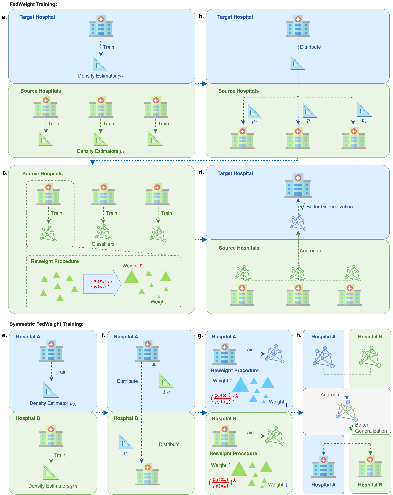
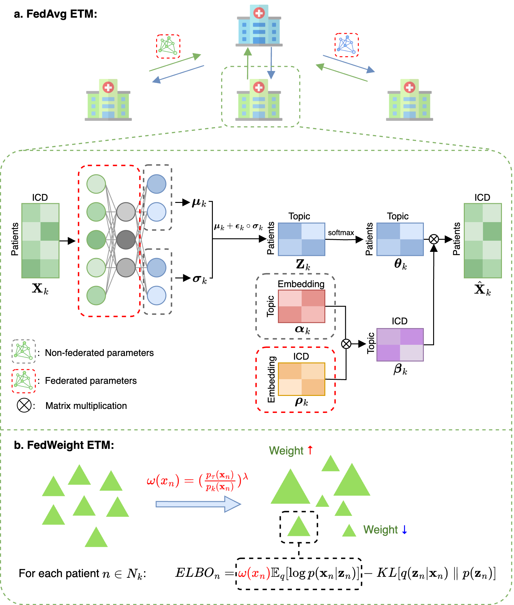

# FedWeight

## Description
Federated Learning (FL) has emerged as a promising approach for real-world medical research, which enables the analysis of distributed patient data while preserving privacy. However, a key challenge in FL is covariate shift, where data distributions vary significantly across different hospitals, leading to performance degradation when models are deployed in new environments.

To address this, we introduce Federatively Weighted (FedWeight), a novel framework that re-weights patient data from source hospitals using density estimation techniques. This approach aligns the trained model with the target hospital’s data distribution, thus mitigating covariate shift.

To extend our method to unsupervised learning, we integrate FedWeight into a federated embedded topic model (ETM), resulting in FedWeight-ETM, which enhances topic modelling performance across diverse hospital datasets.

## Table of Contents
- [FedWeight](#fedweight)
- [FedWeight-ETM](#fedweight-etm)
- [Installation](#installation)
- [Environment](#environment)
- [Usage](#usage)
- [Paper](#paper)

## FedWeight



FedWeight training process. **a.** The target and source hospitals independently train their density estimators. **b.** The target hospital shares its density estimator with all source hospitals. **c.** Each source hospital calculates a patient-specific re-weight, which is used to train its local model. **d.** The target hospital aggregates the parameters from the source hospitals using the FL algorithm, which better generalizes the target hospital’s data. Symmetric FedWeight training process: **e.** Hospital A and B independently train their density estimators. **f.** Hospital A and B share their density estimators to each other. **g.** Hospital A and B regard each other as targets, estimating the re-weight, which is used to train its local model. **h.** Aggregate the local models from Hospital A and B using FL algorithm.

## FedWeight-ETM



FedAvg-ETM and FedWeight-ETM training process. **a.** FedAvg-ETM. In each local hospital $k \in K$, $\mathbf{X}_k$ is input into the encoder, whose output goes into two separate linear layers and produces $\boldsymbol{\mu}_k$ and $\boldsymbol{\sigma}_k$. Then, through the re-parameterization trick, we obtain the latent representation $\mathbf{Z}_k$. After applying the softmax function, $\mathbf{Z}_k$ gives the patient-topic distribution $\boldsymbol{\theta}_k$. The learnable topic embedding $\boldsymbol{\alpha}_k$ and ICD embedding $\boldsymbol{\rho}_k$ generate the topic-ICD mixture $\boldsymbol{\beta}_k$. Then, $\boldsymbol{\beta}_k$ is multiplied with $\boldsymbol{\theta}_k$ to reconstruct the input. During federated averaging, only the encoder network and the ICD embedding are uploaded to the target hospital for aggregation, whilst all other model parameters are kept locally updated.
**b.** FedWeight-ETM. FedWeight-ETM builds on FedAvg-ETM by applying a re-weight to the log-likelihood term of the ELBO function for each patient.

## Environment
- Python 3.8+
- Required libraries (see `requirements.txt`)

## User Manual
### Step 0: Installation
- Clone the repository from GitHub
```bash
git clone https://github.com/li-lab-mcgill/FedWeight.git
```

- Create a Python virtual environment
```bash
python -m venv venv
source venv/bin/activate
```

- Install the required libraries
```bash
pip install -r requirements.txt
```

### Step 1: Download dataset and drug harmonization
- Create `data` directory under the root file.
- Inside `data` directory, create `eicu` and `pretrained` subdirectory.
- Download the eICU Collaborative Research Database (eICU) and put it inside the `data/eicu` folder.
- Download the BioWordVec model from https://github.com/ncbi-nlp/BioSentVec and put it inside the `data/pretrained` folder.
- Create `output` directory under the root file
- Run `drug_harmonization.py` script. It may take a couple of hours.
- Find the harmonized dataset `eicu_harmonized.csv` inside `output` folder.
- Run similar steps for Medical Information Mart for Intensive Care (MIMIC-III) dataset: https://mimic.mit.edu/.
- Combine both harmonized eICU and MIMIC-III dataset and put it inside `data` folder.

### Step 2: Run FedWeight experiments

This step runs FedWeight experiments to predict clinical outcomes (i.e. mortality, ventilator, sepsis, ICU length of stay).

```bash
python3 main.py \
    experiment=${experiment} \
    experiment.task=${task} \ 
    experiment.reweight_lambda=${reweight_lambda} \
    experiment.algorithm=${algorithm} \
    experiment.target_hospital_id=${target_hospital_id} \
    experiment.density_estimator=${estimator}
```
Parameters:
- `experiment`: The experiment name
    - `eicu`: Run FL model on eICU
    - `mimic`: Run FL model on MIMIC
    - `eicu_central`: Run centralized model on eICU
    - `mimic_central`: Run centralized model on MIMIC
- `task`: The task name
    - `death`: Mortality prediction
    - `ventilator`: Ventilator use prediction
    - `sepsis`: Sepsis diagnosis prediction
    - `length`: ICU length of stay prediction
- `reweight_lambda`: Hyper-parameter that controls the degree of re-weighting
- `algorithm`: The FL algorithm
    - `weighted`: FedWeight
    - `unweighted`: FedAvg
- `target_hospital_id`: The target hospital ID ("167" "420" "199" "458" "252")
- `density_estimator`: The density estimator
    - `made`: MADE
    - `vae`: VAE
    - `vqvae`: VQ-VAE

After running the experiments, you can find the trained models saved in `output` folder.

### Step 3: Identify influential drugs and lab tests
With trained FedWeight model, we can use it to identify drugs and lab tests associated with clinical outcomes. Under the `notebook` directory, run `analyze_causal.ipynb` notebook.

### Step 4: Run ETM, FedAvg-ETM, and FedWeight-ETM

This step runs experiments to identify latent topics in federated learning settings.

Inside `notebook/etm` folder, run the following commands:
```bash
# Non-federated ETM
python3 etm.py --num_topics ${num_topics}

# FedAvg-ETM
python3 fedavg_etm.py --num_topics ${num_topics}

# FedWeight-ETM
python3 fedweight_etm.py --num_topics ${num_topics}
```
Parameters:
- `num_topics`: Number of topics (e.g. 64)

### Step 5: Identify mortality-associated topics and ICD codes
By using FedWeight-ETM, we can identify mortality-associated topics and ICD codes. Under the `notebook/etm` directory, run `etm_analyse_icd_result.ipynb` notebook.

## Citation
